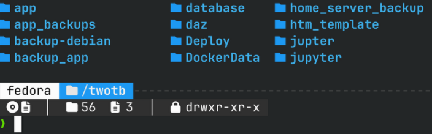
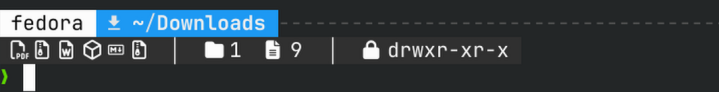
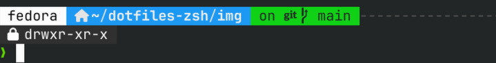

# ZSH Dotfiles

> Configuração completa e automatizada de terminal ZSH para Linux — visual moderno, informativo e produtivo.







---

## Funcionalidades

- **Prompt de 3 linhas** com informações contextuais em tempo real
- **Detecção automática de tipos de arquivo** por extensão — exibe ícones coloridos ao entrar em qualquer diretório
- **Integração Git** — mostra branch atual, status de alterações
- **Ícones de pasta especiais** — Home, Downloads, Documentos, Imagens, Músicas, Vídeos
- **Permissões e contadores** — total de arquivos, pastas e permissões do diretório
- **Aliases produtivos** — `ls`, `cat`, `tree` substituídos por versões modernas

## Stack

| Componente | Descrição |
|---|---|
| [Oh-My-Zsh](https://ohmyz.sh/) | Framework de configuração ZSH |
| [Powerlevel10k](https://github.com/romkatv/powerlevel10k) | Tema de prompt rápido e customizável |
| [eza](https://eza.rocks/) | Substituto moderno do `ls` com ícones e Git |
| [bat](https://github.com/sharkdp/bat) | Substituto do `cat` com syntax highlighting |
| [fzf](https://github.com/junegunn/fzf) | Fuzzy finder para histórico e arquivos |
| [zsh-autosuggestions](https://github.com/zsh-users/zsh-autosuggestions) | Sugestões baseadas no histórico |
| [zsh-syntax-highlighting](https://github.com/zsh-users/zsh-syntax-highlighting) | Destaque de sintaxe na linha de comando |
| [Nerd Fonts](https://www.nerdfonts.com/) | JetBrainsMono, MesloLGS, CascadiaCode, Inter |

## Layout do Prompt

```
 fedora  ~/projeto/backend  on  main              at 16:09
       │  5  6  │  drwxr-xr-x
❯
```

| Linha | Conteúdo |
|-------|----------|
| **1** | Ícone do OS + caminho + branch Git + hora |
| **2** | Ícones por tipo de arquivo │ pastas/arquivos │ permissões |
| **3** | Prompt de input `❯` |

## Tipos de Arquivo Detectados

### Código

| Ícone | Extensões |
|-------|-----------|
|  | `.py` |
|  | `.js` `.mjs` `.cjs` |
|  | `.ts` `.tsx` |
|  | `.html` `.htm` |
|  | `.css` `.scss` `.sass` |
|  | `.json` |
|  | `.yml` `.yaml` |
|  | `.md` |
|  | `.sh` `.bash` `.zsh` |
|  | `.go` |
|  | `.rs` |
|  | `.java` |
|  | `.c` `.h` |
|  | `.cpp` `.hpp` `.cc` |
|  | `.rb` |
|  | `.php` |
|  | `.vue` |
|  | `.dart` |
|  | `.lua` |
|  | `.r` |
|  | `.sql` |
|  | `.xml` |
|  | `.toml` `.ini` `.cfg` |
|  | `.txt` |

### Mídia (mesmo ícone por categoria, cor diferente por formato)

| Categoria | Formatos (cada um com cor distinta) |
|-----------|-------------------------------------|
|  Imagem | `png` `jpg` `gif` `bmp` `webp` `ico` `svg` |
|  Áudio | `mp3` `wav` `flac` `ogg` `aac` `wma` `m4a` |
|  Vídeo | `mp4` `mkv` `avi` `mov` `wmv` `flv` `webm` |

### Documentos e outros

| Ícone | Tipo |
|-------|------|
|  | PDF |
|  | DOC / DOCX / ODT |
|  | XLS / XLSX / ODS |
|  | PPT / PPTX / ODP |
|  | CSV |
|  | PSD |
|  | AI |
|  | Sketch |
|  | Arquivos compactados (zip, tar, gz, 7z, rar...) |
|  | ISO / IMG |
|  | Fontes (ttf, otf, woff) |
|  | Binários (bin, exe, AppImage, deb, rpm) |
|  | Dockerfile / docker-compose |
|  | Makefile |

## Instalação

```bash
git clone https://github.com/gleisonnanet/dotfiles-zsh.git
cd dotfiles-zsh
chmod +x install.sh
./install.sh
```

O instalador detecta automaticamente sua distro e instala tudo o que é necessário.

## Aliases Incluídos

| Alias | Comando | Descrição |
|-------|---------|-----------|
| `ls` | `eza --icons` | Listagem com ícones |
| `ll` | `eza -lah --icons --git` | Listagem detalhada com Git |
| `lt` | `eza --tree --level=2 --icons` | Árvore de diretórios |
| `cat` | `bat --style=plain` | Cat com syntax highlighting |
| `..` | `cd ..` | Subir um diretório |
| `...` | `cd ../..` | Subir dois diretórios |
| `reload` | `source ~/.zshrc` | Recarregar configuração |
| `ports` | `ss -tulnp` | Listar portas abertas |
| `myip` | `curl -s ifconfig.me` | IP público |

## Distros Suportadas

| Distro | Gerenciador |
|--------|-------------|
| Fedora / RHEL / CentOS / Rocky | `dnf` |
| Ubuntu / Debian / Mint / Pop!_OS | `apt` |
| Arch / Manjaro / EndeavourOS | `pacman` |
| openSUSE | `zypper` |
| FreeBSD | `pkg` |

## Backup e Restauração

O instalador cria backup automático em `~/.dotfiles-backup/` antes de sobrescrever qualquer arquivo.

```bash
# Restaurar configurações anteriores
./uninstall.sh
```

## Requisitos

- `git`, `curl`, `unzip`
- Acesso `sudo` (para instalar pacotes)
- Terminal com suporte a Unicode e cores (Konsole, Alacritty, Kitty, WezTerm, GNOME Terminal)

## Configuração KDE Plasma (Automática)

Se o KDE for detectado, o instalador também configura:
- Antialiasing e hinting de fontes
- Fonte do sistema: Inter 10pt
- Fonte fixa: JetBrainsMono Nerd Font 10pt
- Perfil Konsole com ZSH e fonte Nerd Font

## Testar com Docker

Teste a instalação em um container descartável sem afetar seu sistema. Escolha sua distro, rode o comando e depois entre no container para explorar o ZSH configurado.

### Fedora

```bash
docker run -d --name zsh-test fedora:43 bash -c \
  "dnf install -y git curl unzip sudo && \
   useradd -m tester && echo 'tester ALL=(ALL) NOPASSWD:ALL' >> /etc/sudoers && \
   su - tester -c 'git clone https://github.com/gleisonnanet/dotfiles-zsh.git && \
   cd dotfiles-zsh && chmod +x install.sh && ./install.sh' && \
   tail -f /dev/null"
```

### Ubuntu

```bash
docker run -d --name zsh-test ubuntu:24.04 bash -c \
  "apt update && apt install -y git curl unzip sudo && \
   useradd -m -s /bin/bash tester && echo 'tester ALL=(ALL) NOPASSWD:ALL' >> /etc/sudoers && \
   su - tester -c 'git clone https://github.com/gleisonnanet/dotfiles-zsh.git && \
   cd dotfiles-zsh && chmod +x install.sh && ./install.sh' && \
   tail -f /dev/null"
```

### Arch Linux

```bash
docker run -d --name zsh-test archlinux:latest bash -c \
  "pacman -Sy --noconfirm git curl unzip sudo && \
   useradd -m tester && echo 'tester ALL=(ALL) NOPASSWD:ALL' >> /etc/sudoers && \
   su - tester -c 'git clone https://github.com/gleisonnanet/dotfiles-zsh.git && \
   cd dotfiles-zsh && chmod +x install.sh && ./install.sh' && \
   tail -f /dev/null"
```

### openSUSE

```bash
docker run -d --name zsh-test opensuse/tumbleweed bash -c \
  "zypper install -y git curl unzip sudo && \
   useradd -m tester && echo 'tester ALL=(ALL) NOPASSWD:ALL' >> /etc/sudoers && \
   su - tester -c 'git clone https://github.com/gleisonnanet/dotfiles-zsh.git && \
   cd dotfiles-zsh && chmod +x install.sh && ./install.sh' && \
   tail -f /dev/null"
```

### FreeBSD

```bash
docker run -d --name zsh-test freebsd:14.2 sh -c \
  "pkg install -y git curl unzip sudo bash && \
   pw useradd tester -m -s /bin/sh && echo 'tester ALL=(ALL) NOPASSWD: ALL' >> /usr/local/etc/sudoers && \
   su - tester -c 'git clone https://github.com/gleisonnanet/dotfiles-zsh.git && \
   cd dotfiles-zsh && chmod +x install.sh && bash install.sh' && \
   tail -f /dev/null"
```

> **Nota:** O Docker para FreeBSD requer um host FreeBSD ou uma VM FreeBSD. Em hosts Linux, use uma VM com `vagrant` ou teste diretamente em um sistema FreeBSD.

> **Importante:** Execute apenas **um** dos comandos acima. Se quiser testar outra distro, remova o container anterior com `docker rm -f zsh-test` antes de criar um novo.

### Acompanhar a instalação

```bash
docker logs -f zsh-test
```

Aguarde até ver a mensagem de conclusão. Pressione `Ctrl+C` para sair dos logs.

### Entrar no container e testar o ZSH

```bash
docker exec -it zsh-test su - tester -s /bin/zsh
```

Você verá o prompt de 3 linhas com ícones funcionando. Navegue entre pastas para ver os ícones mudarem conforme o conteúdo do diretório.

Para sair do container: `exit` ou `Ctrl+D`.

### Limpar quando terminar

```bash
docker rm -f zsh-test
```

---

## Aviso Legal

Este projeto é distribuído sob a licença **MIT** e é fornecido **"como está" (as-is)**, sem garantias de qualquer tipo, expressas ou implícitas.

**Ao utilizar este software, você concorda que:**

- O uso é por **sua conta e risco**. Os autores não se responsabilizam por quaisquer danos, perda de dados, ou problemas decorrentes da instalação ou uso deste projeto.
- O script realiza alterações em arquivos de configuração do sistema (`~/.zshrc`, `~/.p10k.zsh`, configurações do KDE). Embora o instalador crie backups automáticos, é sua responsabilidade verificar que o backup foi realizado corretamente.
- Este projeto não possui qualquer afiliação com as ferramentas de terceiros que instala (Oh-My-Zsh, Powerlevel10k, eza, bat, fzf, Nerd Fonts, etc). Cada uma possui sua própria licença.
- Você é responsável por revisar o código antes de executá-lo em ambientes de produção.

---

## Licença

[MIT](LICENSE) — use, modifique e distribua livremente.
